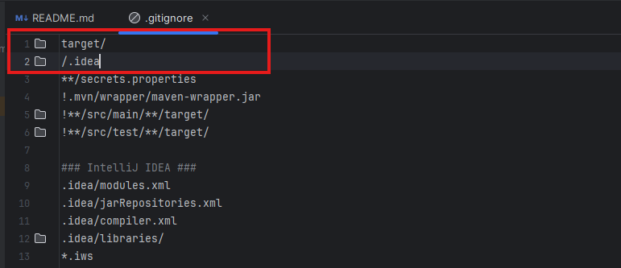
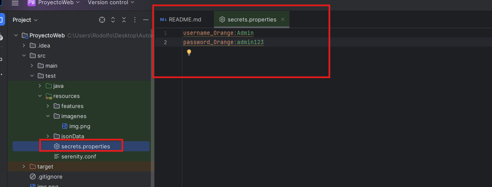
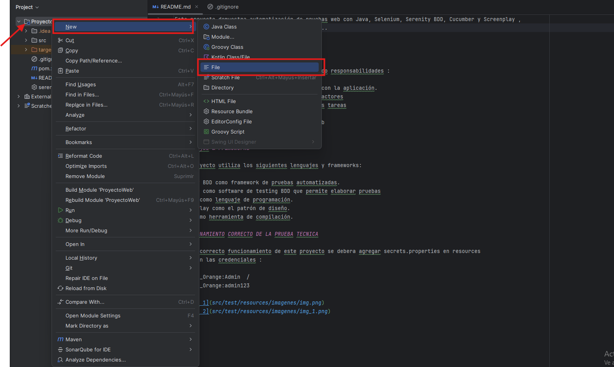
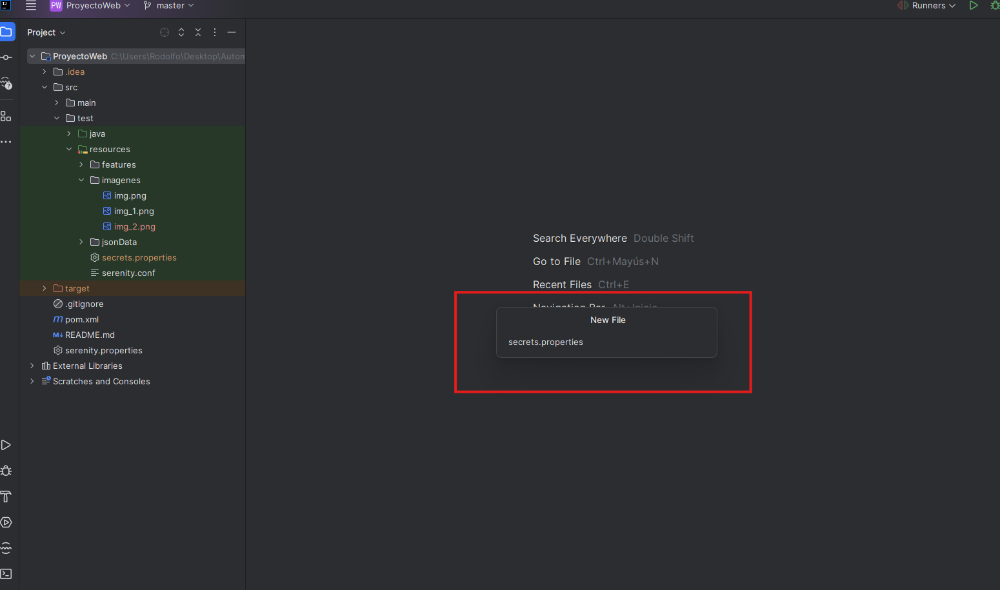

# Prueba Técnica Web Choucair - Automatización 

Este proyecto demuestra automatización de pruebas web con Java, Selenium, Serenity BDD, Cucumber y Screenplay , 
siguiendo buenas prácticas de diseño de pruebas..

# Arquitectura del proyecto

El proyecto sigue el patrón Screenplay, separando responsabilidades :

- Actors: Representan usuarios que interactúan con la aplicación.
- Tasks: Acciones completas realizadas por los actores
- Interactions: Acciones que se usaran en varias tareas
- Questions: Validaciones o consultas de estado 
- Interfaces: Localizadores de los elementos web 

# Lenguajes & Frameworks

Este proyecto utiliza los siguientes lenguajes y frameworks:

Serenity BDD como framework de pruebas automatizadas.
Cucumber como software de testing BDD que permite elaborar pruebas
Java 11 como lenguaje de programación.
Screen Play como el patrón de diseño.
MAVEN como herramienta de compilación.

# FUNCIONAMIENTO CORRECTO DE LA PRUEBA TECNICA

Para el correcto funcionamiento de este proyecto se debera agregar secrets.properties en resources
estas son las credenciales :

username_Orange:Admin  /  
password_Orange:admin123

